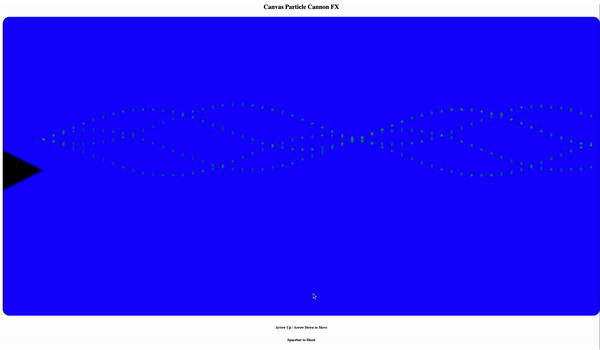

[LIVE DEMO](https://canvasparticlecannonfx.herokuapp.com/)

# Canvas Particle Cannon FX

This is a simple project where I created a "cannon" that shoots particles. Simply by animating particles with trig functions and requestAnimationFrame.

## Launching It
1. `npm i`
2. `npm run start`

### How to move / shoot
1. Arrow Up / Arrow Down to move
2. Spacebar to shoot